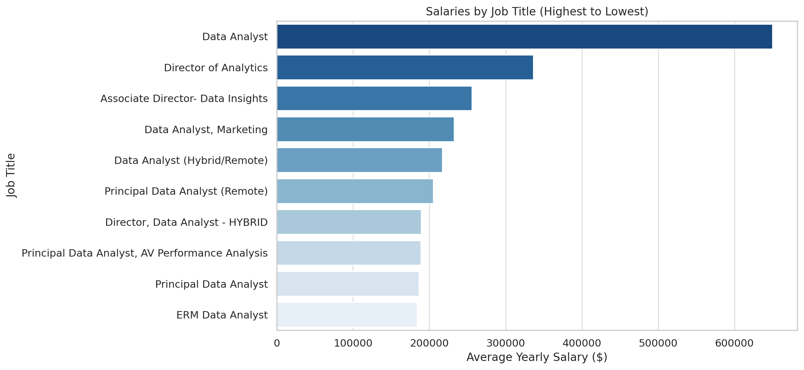
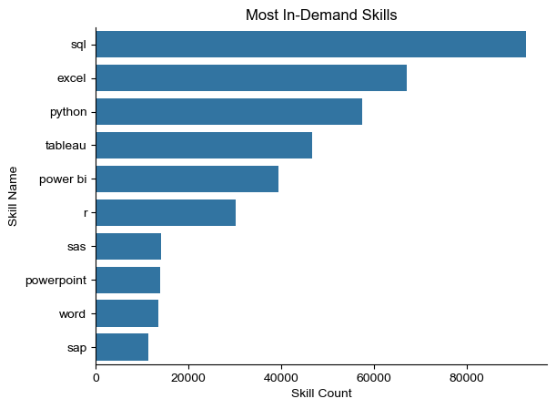
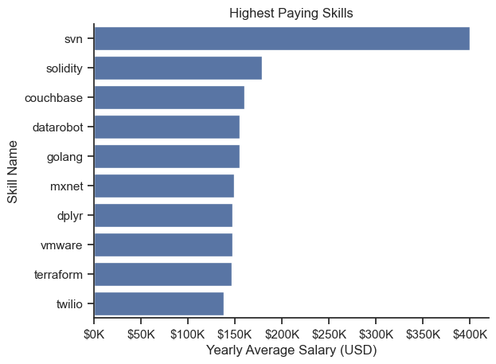
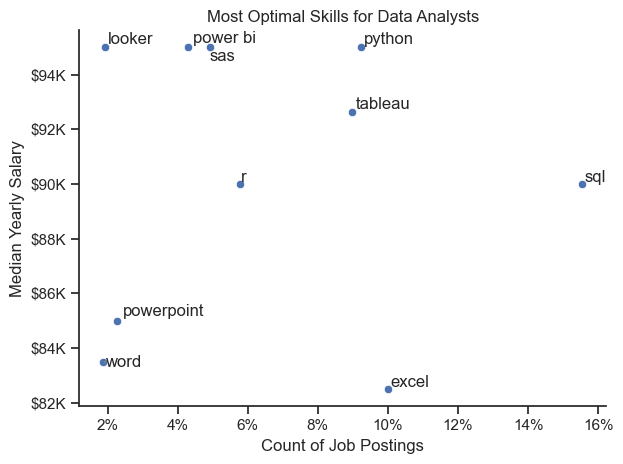

# Introduction
In this project, I'm focusing on analyzing the job
market for Data Analysts using SQL to manipulate 
and organize the data for insights. If you're interested in looking at the sql queries, look here: [project_sql folder](/project_sql/).
# Background
The data is exploring the  job market in 2023, and comes from https://www.lukebarousse.com/sql. I'm interested in looking at which are the most optimal skills to learn as a Data Analyst in order to maximize salary and likelihood in matching job role requirements.
# Tools I Used
I used multiple tools in order to complete this project, such as:
- SQL: This is the backbone of my analytical work, where I queried the database to unearth insights into the most optimal skills for Data Analysts.
- PostgreSQL: This served as the data management system, ideal for handling the job postings data.
- Visual Studio Code: This IDE is what I used to write and execute my SQL queries. It also allows me to connect to my PostgreSQL server and manage its data.
- Git & Github: Essential for version control and sharing my SQL scripts and analysis, ensuring collaboration and project tracking.

# Analysis
Each query for this project is aimed at investigating specific aspects of the data analyst job market. Below are the queries I implemented.

### 1. Top Paying Data Analyst Jobs
To identify the highest paying roles, I was curious in looking at remote data analyst jobs. So after filtering for only jobs meeting that criteria, I ordered the joined table by the year average salary. Below is the code I used.
```sql
SELECT
    job_id,
    job_title,
    name AS company_name, -- comes from company dim table
    job_location,
    job_schedule_type,
    salary_year_avg,
    job_posted_date
FROM 
    job_postings_fact

LEFT JOIN company_dim -- including company_dim data to grab company name
    ON job_postings_fact.company_id  = company_dim.company_id

WHERE
    job_title_short = 'Data Analyst'
    AND job_work_from_home IS TRUE -- checking for remote jobs
    AND salary_year_avg IS NOT NULL 

ORDER BY
    salary_year_avg DESC -- ordering from greatest to least

LIMIT 10; -- looking at only the top 10 roles
```
### 2. Top Paying Job Skills
To identify the highest paying skills, I first filtered for remote data analyst jobs, then joined the skill and job postings table, and finally ordered the table by yearly average salary. Below is the code I used to execute this query.
```sql
WITH top_paying_jobs AS (
    SELECT
        job_id,
        job_title,
        job_title_short,
        name AS company_name, -- comes from company dim table
        salary_year_avg
    FROM 
    job_postings_fact

LEFT JOIN company_dim -- including company_dim data to grab company name
    ON job_postings_fact.company_id  = company_dim.company_id


WHERE
    job_title_short = 'Data Analyst'
    AND job_work_from_home IS TRUE -- checking for remote jobs
    AND salary_year_avg IS NOT NULL 
)

SELECT 
    top_paying_jobs.*,
    skills AS job_skills

FROM 
    top_paying_jobs
LEFT JOIN skills_job_dim -- including company_dim data to grab company name
    ON top_paying_jobs.job_id = skills_job_dim.job_id -- joining these tables in order to get skill id 
LEFT JOIN skills_dim
    ON skills_job_dim.skill_id = skills_dim.skill_id -- we can then connect skill id to corresponding skill name

ORDER BY
    salary_year_avg DESC -- ordering from greatest to least
```
### 3. In-Demand Job Skills
I filtered for Data Analyst roles, and then did an aggregation on each unique skill to gauge the popularity of each different type of skill. I then ordered the query by skill count. Below is the code I executed for this query.

```sql
WITH job_skills AS (
    SELECT
        skill_id,
        COUNT(skill_id) as skill_count
    FROM
        skills_job_dim AS skills_to_job
    INNER JOIN job_postings_fact AS job_postings ON job_postings.job_id = skills_to_job.job_id
    WHERE
        job_title_short = 'Data Analyst'
    GROUP BY
        skill_id
    
)

SELECT
    skills AS skill_name,
    skill_count
FROM
    job_skills
INNER JOIN skills_dim AS skills ON skills.skill_id = job_skills.skill_id
ORDER BY
    skill_count DESC
LIMIT 5;
```
### 4. Top Skills
This one is similar to query #2, except in this case, I wanted to aggregate by the average of the year salary column and compare skills based on this average salary quantity. Below is the code I used to execute this query:
```sql
WITH job_skills AS (
    SELECT
        skill_id,
        ROUND(AVG(salary_year_avg), 0) AS avg_salary
    FROM
        skills_job_dim AS skills_to_job
    INNER JOIN job_postings_fact AS job_postings ON job_postings.job_id = skills_to_job.job_id
    WHERE
        job_title_short = 'Data Analyst' 
        AND salary_year_avg IS NOT NULL
    GROUP BY
        skill_id
    
)

SELECT
    job_skills.skill_id,
    skills AS skill_name,
    avg_salary
FROM
    job_skills
INNER JOIN skills_dim AS skills ON skills.skill_id = job_skills.skill_id
ORDER BY
    avg_salary DESC
LIMIT 25;
```
### 5. Optimal Skills
In this query, I basically combined query #3 and #4 in order to understand how I can maximize both the skill count and the corresponding yearly average salary with each skill count to find the most in-demand skills with the highest salaries. Below is the code I used to execute this query.

```sql
WITH skills_demand AS (
    SELECT
        skills_dim.skill_id,
        skills AS skill_name,
        COUNT(skills_job_dim.skill_id) as skill_count
    FROM
        job_postings_fact
    INNER JOIN skills_job_dim ON job_postings_fact.job_id = skills_job_dim.job_id
    INNER JOIN skills_dim ON skills_job_dim.skill_id = skills_dim.skill_id
    WHERE
        job_title_short = 'Data Analyst'
         AND salary_year_avg IS NOT NULL
        AND job_work_from_home = TRUE
    GROUP BY
        skills_dim.skill_id
), average_salary AS (
    SELECT
        skills_dim.skill_id,
        skills AS skill_name,
        ROUND(AVG(salary_year_avg), 0) AS avg_salary
    FROM
        job_postings_fact
    INNER JOIN skills_job_dim ON job_postings_fact.job_id = skills_job_dim.job_id
    INNER JOIN skills_dim ON skills_job_dim.skill_id = skills_dim.skill_id
    WHERE
        job_title_short = 'Data Analyst' 
        AND salary_year_avg IS NOT NULL
        AND job_work_from_home = TRUE
    GROUP BY
        skills_dim.skill_id
)

SELECT
    skills_demand.skill_id,
    skills_demand.skill_name,
    skill_count,
    avg_salary

FROM
    skills_demand
INNER JOIN average_salary ON skills_demand.skill_id = average_salary.skill_id

WHERE
    skill_count > 10 -- did this to limit the number of high paying but low count skills
ORDER BY
    avg_salary DESC, 
    skill_count DESC
```

# Results
Note: I used Python to generate the plots of the most important queries I wanted to highlight. 
### Query 1. 

### Query 3.
This query gave us a good idea of which skills to look out for in each skill type: In terms of coding languages, knowing SQL and Python will give you a high likelihood of matching with various job roles. Similarly, it would be more advantageous statistcally speaking to know Tableau over PowerBI, since Tableau has a higher skill count.

### Query 4.
We see that  SVN (legacy systems) has the highest average salaries of all the skills. This demonstrates that specialized expertise in emerging or older technologies can lead to high salaries. DataRobot and MXNet being the 4th and 6th highest salaries (respectively) highlight the growing demand for AI-driven analytics.

### Query 5.
This query gives us the most useful insights where we can maximize both skill likelihood and salary. It shows which skills will lead us to the best outcomes in terms of maximizing these two previously mentioned quantities. In conclusion, knowing SQL, Python and Tableau leads to maximizing both skill likelihood and yearly salary. 

